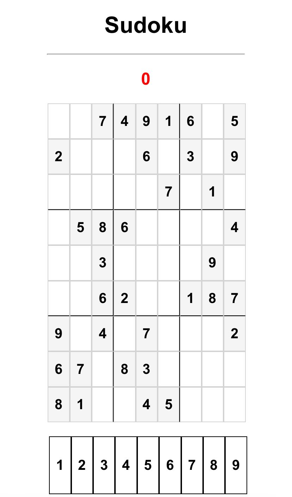

# Sudoku

Bem-vindo ao jogo de Sudoku! Este é um jogo de Sudoku simples e interativo, implementado em JavaScript, HTML e CSS. Teste suas habilidades de resolução de quebra-cabeças e divirta-se!

## Funcionalidades

- **Interatividade Completa**: Selecione e insira números diretamente no tabuleiro.
- **Verificação de Erros**: Notificações de erro ao inserir números incorretos.
- **Design Responsivo**: Jogue em qualquer dispositivo, seja desktop ou móvel.
- **Reinício Rápido**: Reinicie o jogo facilmente para jogar novamente.

## Como Jogar

1. **Selecione um Número**: Clique em um número na parte inferior do tabuleiro para selecioná-lo.
2. **Preencha uma Célula**: Clique em uma célula vazia no tabuleiro para preenchê-la com o número selecionado.
3. **Complete o Sudoku**: Preencha todas as células vazias do tabuleiro com os números corretos para completar o Sudoku.
4. **Verificação de Erros**: Erros serão sinalizados na parte superior do tabuleiro.
5. **Reiniciar o Jogo**: Ao preencher todos os espaços vazios corretamente, você pode reiniciar a página para jogar novamente.

## Demonstração

Confira a aparência do tabuleiro inicial do jogo:

## Tecnologias Utilizadas

- **JavaScript**: Lógica do jogo e interatividade.
- **HTML**: Estrutura do tabuleiro e elementos do jogo.
- **CSS**: Estilização e design responsivo.

## Contribuindo

Contribuições são bem-vindas! Se você tiver sugestões, encontrar bugs ou quiser adicionar novas funcionalidades, sinta-se à vontade para abrir uma issue ou enviar um pull request.

1. Faça um fork do repositório.
2. Crie um branch para sua feature (`git checkout -b minha-feature`).
3. Commit suas mudanças (`git commit -m 'Adiciona minha feature'`).
4. Envie para o branch (`git push origin minha-feature`).
5. Abra um Pull Request.

## Licença

Este projeto está licenciado sob a [Licença MIT](LICENSE).

## Contato

Para mais informações ou dúvidas, entre em contato:
- **E-mail**: marcellasantoscardoso@gmail.com
